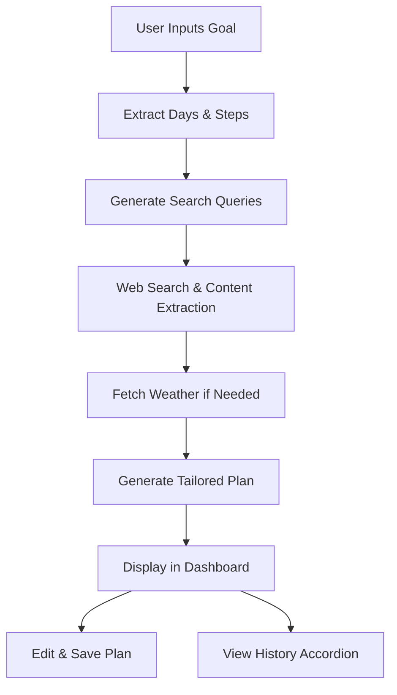

# PlanPilot-AI

A sophisticated, AI-powered web application built with Flask that assists users in generating detailed, tailored plans or guides based on natural language goals. Leveraging web search, content extraction, and generative AI, it creates actionable itineraries, learning paths, or task breakdowns, complete with weather forecasts (where relevant), resource links, and Google-mapped locations. The dashboard features an intuitive UI with real-time progress animations, editable plans, and an accordion-style history viewer.

## How It Works

The application processes user-input goals through a multi-step pipeline:
1. **Goal Analysis**: Extracts key parameters like duration and weather needs using Gemini AI.
2. **Search and Extraction**: Generates targeted queries, searches the web via Tavily, extracts relevant content (handling HTML/PDF), and finds alternatives for failed URLs.
3. **Plan Generation**: Breaks the goal into steps, incorporates sources and weather data, and crafts a customized Markdown response (e.g., day-by-day plans or step-by-step guides) with embedded links.
4. **UI Interaction**: Displays progress with animations, renders the plan, allows editing/saving, and maintains a searchable history.

### Simple Workflow Diagram



This diagram illustrates the core flow from input to output, ensuring modularity and extensibility.

## Setup and Installation

### Prerequisites
- Python 3.10+
- Git (for cloning the repository)
- Virtual environment tool (e.g., `venv`)

### Installation Steps
1. **Clone the Repository**:
   ```
   git clone https://github.com/your-username/task-planning-agent.git
   cd task-planning-agent
   ```

2. **Create and Activate Virtual Environment**:
   ```
   python -m venv venv
   source venv/bin/activate  # On Windows: venv\Scripts\activate
   ```

3. **Install Dependencies**:
   ```
   pip install -r requirements.txt
   ```

4. **Configure Environment Variables**:
   - Create a `.env` file in the root directory.
   - Add your API keys:
     ```
     GEMINI_API_KEY=your_gemini_api_key_here
     TAVILY_API_KEY=your_tavily_api_key_here
     ```
   - Obtain keys from [Google AI Studio](https://aistudio.google.com/) for Gemini and [Tavily](https://tavily.com/) for search.

5. **Initialize Database**:
   - The app auto-initializes SQLite on first run, but ensure `task_plans.db` is writable.

## Running the Application
1. **Start the Server**:
   ```
   python app.py
   ```

2. **Access the Dashboard**:
   - Open a browser and navigate to `http://localhost:5000`.
   - Enter a goal in the input area and click "Generate Answer".
   - View progress animations, the generated plan, edit/save changes, and browse history with accordion expansion.

For production, use a WSGI server like Gunicorn and consider NGINX for reverse proxying.

## Examples


## AI Assistance Disclosure

The foundational design, modular architecture, and custom integrations (such as the Flask backend, database management, and UI interactions) were spearheaded by the primary developer, drawing on extensive expertise in web development and AI systems. To optimize certain aspects like prompt engineering for universality and code refinement for efficiency, AI assistants including Grok and Claude were consulted for iterative suggestions, ensuring creative enhancements while maintaining the developer's core vision and control over the project's direction. This collaboration leveraged AI's strengths in rapid prototyping and pattern recognition to accelerate development without compromising originality.


